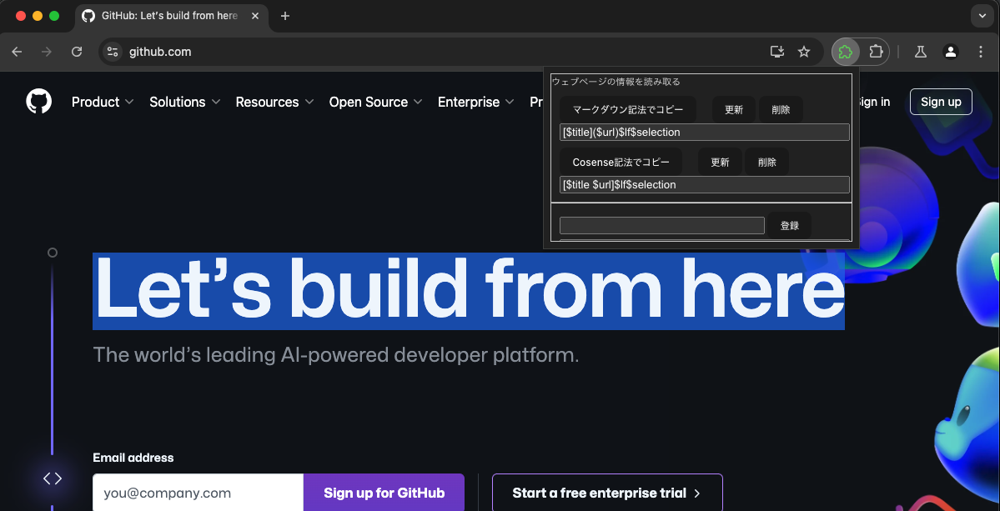

# svelte5-google-chrome-extension

このリポジトリーは、技術書典17「[いまからはじめる Svelte 5](https://techbookfest.org/product/geNC4S5LANeb94wrP9uYd7?productVariantID=7eSJuv79asBgtNQ1A6MVqe)」第３章のサンプルコードです。



## サンプルコードの試しかた

リポジトリーをクローンしたら、npmパッケージをインストールします。

```bash
cd svelte5-google-chrome-extension
npm ci
```

そして、[Vite](https://vite.dev/)のモジュール・バンドル処理を実行し、[WXT](https://wxt.dev/)でウェブブラウザーを起動すると...

```bash
npm run dev
```

アドレスバーの右側のアイコンに拡張機能が並んでいます。
